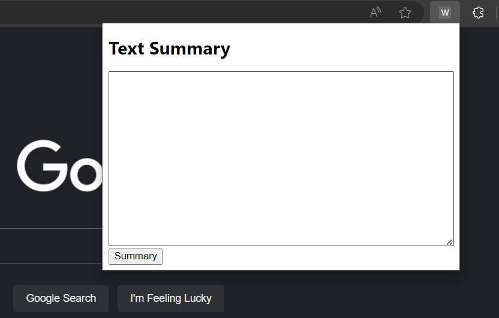

# Google Extension for Effortless Text Summarization

## Description
The Text Summarization Google extension simplifies online reading by condensing articles into concise summaries. With an intuitive interface featuring a text area and 'Summary' button, it efficiently processes news articles, providing quick access to key information. The extension works by reading the current website's URL, extracting content via a server, and summarizing it using the PEPEGASUS model.

