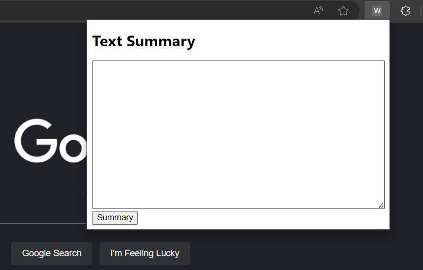

# Google Extension for Effortless Text Summarization

## Description
The Text Summarization Google extension simplifies online reading by condensing articles into concise summaries. With an intuitive interface featuring a text area and 'Summary' button, it efficiently processes news articles, providing quick access to key information. The extension works by reading the current website's URL, extracting content via a server, and summarizing it using the PEGASUS_X model. In my work, I implemented abstractive text summarization techniques based on two papers: [PEGASUS: Pre-training with Extracted Gap-sentences for Abstractive Summarization](https://arxiv.org/pdf/1912.08777.pdf) and [Investigating Efficiently Extending Transformers for Long Input Summarization](https://arxiv.org/pdf/2208.04347.pdf). Specifically, I will utilize the pre-training objectives (GSG) proposed by PEGASUS for the pre-training phase, and I will incorporate the improvements in network architectures and training strategies for long text summarization.

## Getting started

git clone https://gitlab.com/DuongKien2001/summary_page
cd summary_page
pip install -r requirements.txt

## Run training and testing

### Prepare dataset for training model with task GSG

python model/prepare_data.py

### Example of pre-training a model with C4 dataset on a single gpu

python model/train.py --src_len 512 --tgt_len 256 --epochs 6 

### Example of fine-tuning a model with PubMed dataset 

python model/train.py --src_len 6400 --tgt_len 256 --epochs 3 --no-pretrain -r *checkpoint.pth*

### Evaluate the model with the PubMed test set

python model/evaluatePegasusX.py --start_idx 0 --end_idx 7000

## Pretrained models

Pretrained model for PubMed can be downloaded at: ([Link](https://drive.google.com/file/d/1Cot7uRlPyidesHqItssUH4JF5MNEj7Ar/view?usp=sharing)), and should be unzipped in the 'model/checkpoint/finetune' folder.

## Usage

1. Go to a webpage that has an article you want to shorten.
2. Click on the extension icon or use the keyboard shortcut to turn on the extension.
3. On the extension, click the 'Summary' button.
4. Read the brief summary.